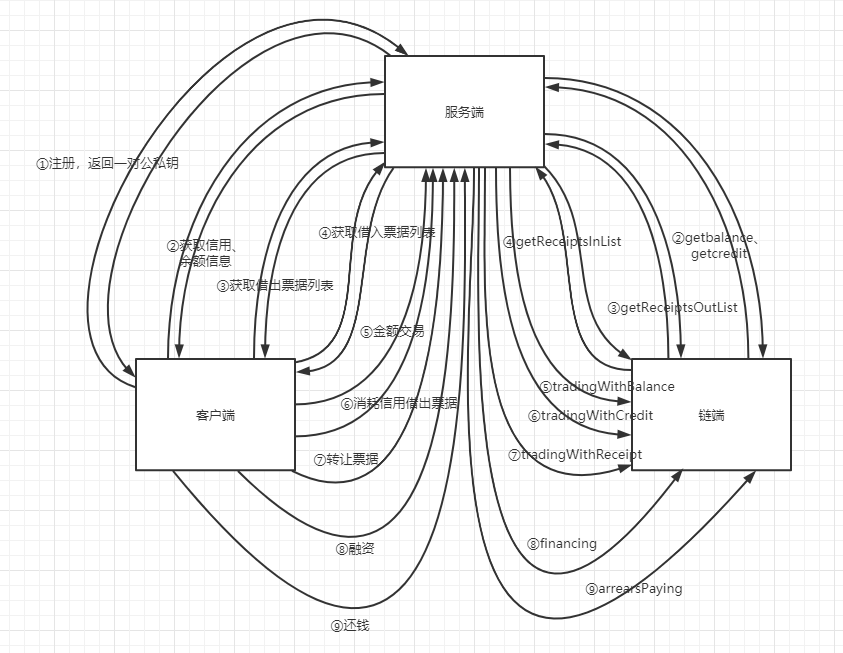
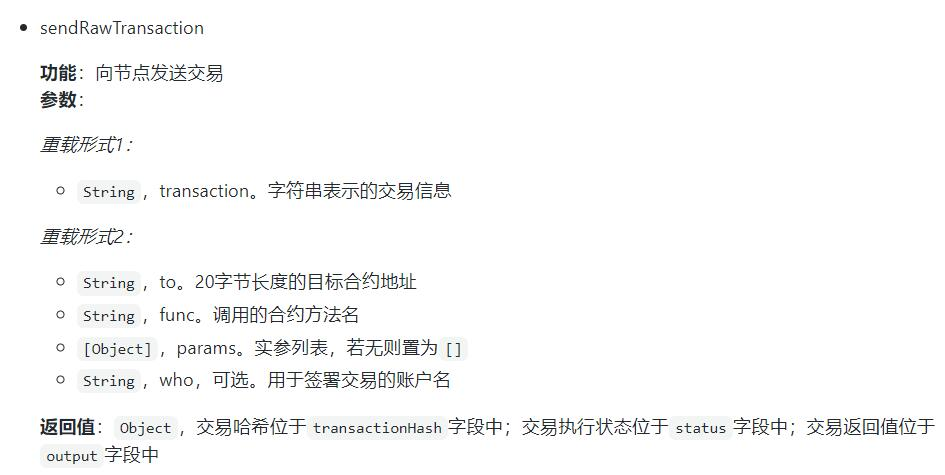
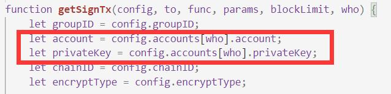
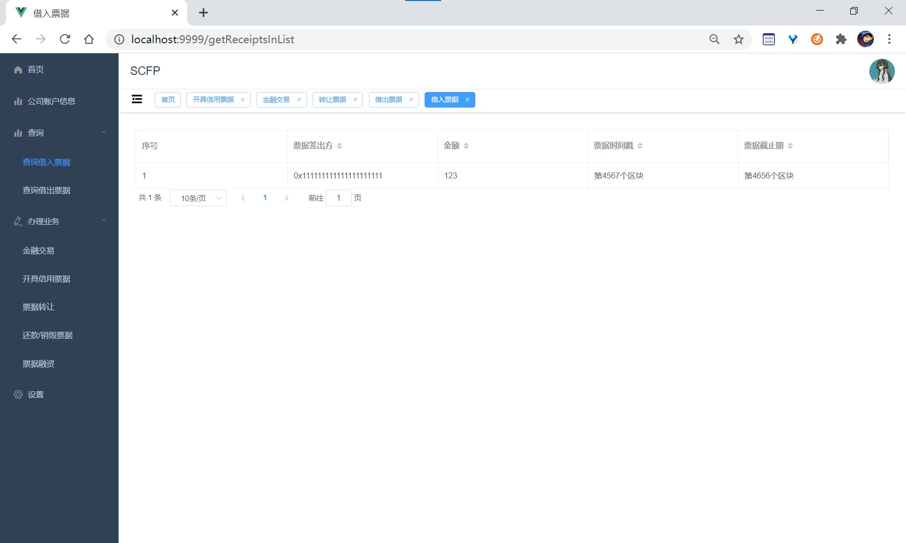
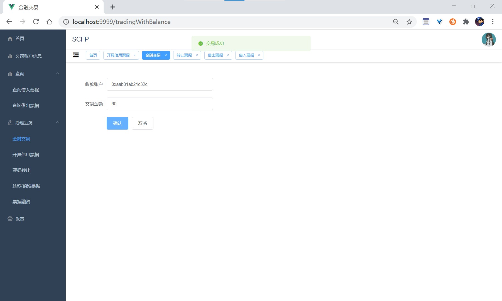
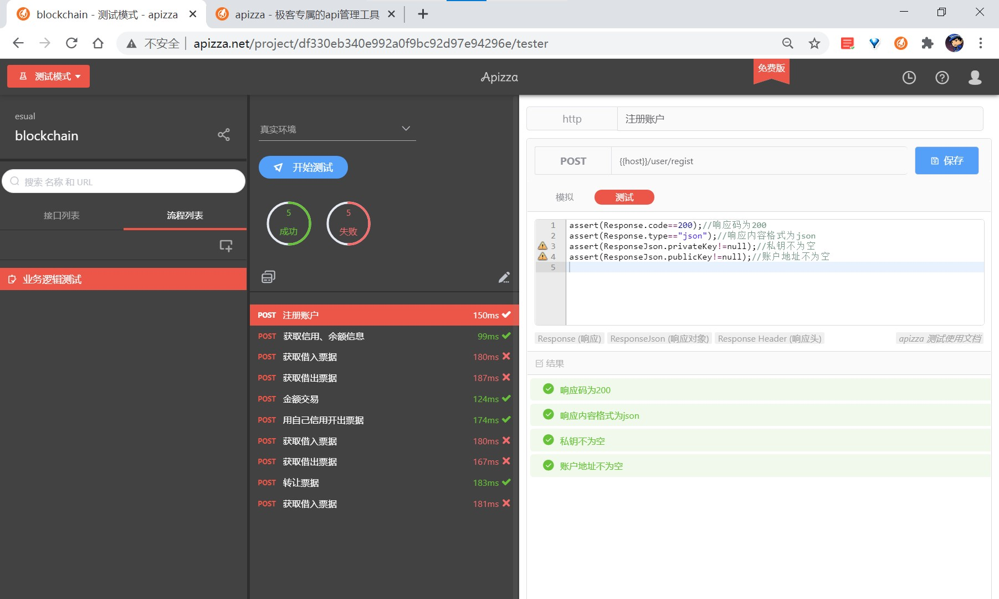

# 项目设计说明

|  组员  |   学号   |   分工    | 
| :----: | :------: | :------: |
| 黄星铭 | 18342032 | 智能合约、API、后端路由sdk调用合约等事宜 |
| 黄绍永 | 18342030 | nodejs-sdk、前后端框架、前端路由、页面等 |
| 刘智斌 | 18342063 | 前端页面、合约功能测试 |

根据提供的供应链场景，基于从第二阶段设计出的智能合约，利用FISCO-BCOS提供的SDK编写前后端，完成最终制品。

## 使用说明
参见[使用说明](使用说明.md)

## 演示视频
[链接](./assert/演示.mp4)

## 技术栈
- 链端
    - FISCO BCOS
- 服务端
    - nodejs
        - express
        - typescript
        - FISCO-BCOS/nodejs-sdk
- 客户端
    - nodejs
        - vue
        - typescript
        - elementui

## 客户端、服务端、链端之间的交互图



## 链端

基本上用的就是第二阶段的逻辑了，不过呢，在先前的合约设计中，我们使用 FISCO BCOS 的 CRUD 服务构建智能合约的存储，实现数据和合约的分离。但是无意中发现，或许是 FISCO BCOS 的 CRUD 服务的弊端（×，又或是我们的操作失误（√。导致在转让票据、还钱这类型的涉及较多table操作的过程中，数据库中的部分信息会平白无故地消失，（这个始终没有找出原因所在，或许得给数据库加个同步锁）。但是呢由于时间问题，这里就简单改成了一个不用table的实现方式，数据存储在合约里面。

数据的存储上就变成了如下的样子：

```
struct Info {
    uint balance;
    uint credit;
}

struct Receipt {
    uint amount;
    address addr;
    uint timestamp;
    uint validity;
}

mapping (address => Info) private CompanyInfo;
mapping (address => Receipt[]) private  Receipts_out;
mapping (address => Receipt[]) private Receipts_in;
```

在功能上和基本实现流程上面跟先前第二阶段上的是一模一样的。

## 服务端

由于这是一个去中心化的区块链应用，在这里，服务端并不会（负责）存储关于用户公私钥的任何信息。换言之，在用户注册的时候产生一对公私钥返回即可，并不做保存；后续过程中也只要用户传进一对正确的公私钥即可。拿到公私钥，利用这对公私钥去调用合约，得到的结果再返回给客户端，这就是服务端所要干的事。

要注册的话就得返回一对公私钥，在这里可以用到 FISCO BCOS 里面的一个``get_account.sh``脚本来产生，然后把从产生出来的文件里面提取出公钥地址和私钥返回给客户端。注意，前面说到服务端不负责保管用户的公私钥，因而返回之后就得把公私钥文件及时清除。

对于服务端跟区块链的对接，我们在这里使用到的是 FISCO BCOS 官方提供的[nodejs-sdk](https://github.com/FISCO-BCOS/nodejs-sdk),主要的核心问题是实现智能合约调用过程中，``meg.sender``的定义。

经过一番稍有点痛苦而漫长的阅读sdk源码的过程中，我们可以利用``sendRawTransaction``里面的第四个参数``who``来实现不同的``meg.sender``。



后续再看源码。追溯到路径``\server\node_modules\nodejs-sdk\packages\api\common\web3lib\web3sync.js``文件里面的``getSignTx``函数。



其实它的公私钥是通过config来得到的，那么这样的话，就需要我们实现config的实时更改。

再看到路径``\server\node_modules\nodejs-sdk\packages\api\common\configuration\configuration.js``下对于``Configuration``的构造，他其实就是根据特定的路径下的配置文件去解析出来（包括账户地址以及私钥）。而这里用到的就是``\server\src\conf\config.json``，那么接下来就是稍微修改下这个配置文件。

```
{
    "encryptType": "ECDSA",
    "accounts": {
        "bank": {
            "type": "pem",
            "value": "./bank.pem"
        },
        "company": {
            "type": "pem",
            "value": "./company.pem"
        }
    },
    "nodes": [
        {
            "ip": "127.0.0.1",
            "port": "20200"
        }
    ],
    "authentication": {
        "key": "./sdk.key",
        "cert": "./sdk.crt",
        "ca": "./ca.crt"
    },
    "groupID": 1,
    "chainID": 1,
    "timeout": 10000
}
```

我们这里的做法就是在 **accounts** 字段里增加一个 **company**，（ps：这里的 **bank** 对应的就是部署合约的中央银行的私钥文件）。后续再将私钥写进这个特定的``company.pem``，经过``Configuration``的解析，这样就能够解决``meg.sender``的问题了。

以``getbalance``的调用为例，就是这样子：

```
let configFile = join(process.cwd(), 'src/conf/config.json');
let companyFile = join(process.cwd(), 'src/conf/company.pem');

export const getBalance = async (privateKey:string):Promise<any> => {
    var filter = (result:any)=>{
        result.output = parseInt(result.output, 16).toString();
        return result.output
    };
    fs.writeFileSync(companyFile, privateKey);
    var config_temp = new Configuration(configFile);
    var web3jService_Temp = new Web3jService(config_temp);
    return web3jService_Temp.sendRawTransaction(contractAddress,getAbi('getbalance'),[],"company").then(filter);
}
```

## 客户端

客户端是为了给企业提供更便利的服务，企业账户可以通过客户端进行金融贸易、信贷贸易、融资等等一系列业务

由于黄星铭同学已经写好了API文档，所以前端可以直接通过这里的mock服务独立开发


基本实现风格就是用表格来罗列信息，和用表单来办理业务  
  
  

## 实验结果&功能测试

因为智能合约的业务逻辑已经在阶段二测试过了，我们阶段三要测试的就主要是前-后-链端之间正常的交互逻辑

使用了现有的工具对所有功能进行了流水测试, 测试结果如下：  


- 除了列表查询，各个接口的业务功能都能正常通过测试
- 列表这里的问题暂时我们定位到了合约结果返回这里，结构体会被返回成十六进制串，需要我们进一步解析成相应的数据结构，正在解决

## 实验心得

在本次实验中，我们实现的是基于 FISCO-BCOS 的供应链金融项目，涵盖链端、服务端、客户端的开发，实验内容较为综合全面，对于区块链、Solidity、以及前端后端都有了更深一层的理解。

较为不幸的是，实验过程稍有点坎坷，遇到的问题较多，比如``meg.sender``的问题、以及nodejs-sdk返回的合约运行结果的解析，都是不容易的事，（借此机会还阅读了大量的底层源码，收获匪浅）。不过也好在是小组工作，倒也提供了相互学习、相互谈论、共同合作的机会。

最后，由于时间不太充裕，因而在合约的部署上有点做的不够好，或许可以将部署上的合约地址写进一个配置文件里面，这样就避免了现在这种服务器每次重启都得重新部署合约这样的尴尬局面。

总的来说，收获还是蛮大的，总体大致地花了几天的时间，由于是三人小组，再加上放假、前期还有其他一些任务等诸多因素，这次实验的时间并未能够分配得恰当，在工作上也是比较难凑齐小组全部人，这也是做得还不够好的地方。