# 功能测试文档

|  组员  |   学号   |
| :----: | :------: |
| 黄星铭 | 18342032 |
| 黄绍永 | 18342030 |
| 刘智斌 | 18342063 |


## 功能测试

### 功能一

功能一：实现采购商品—签发应收账款 交易上链。例如车企从轮胎公司购买一批轮胎并签订应收账款单据。

#### 正常测试

调用tradingWithCredit函数，公司A向公司B签订50万的应收账款单据，承诺一小时内返还。

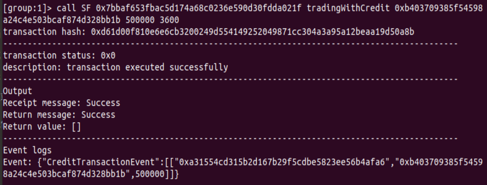

调用后账款的付费方的待付费列表

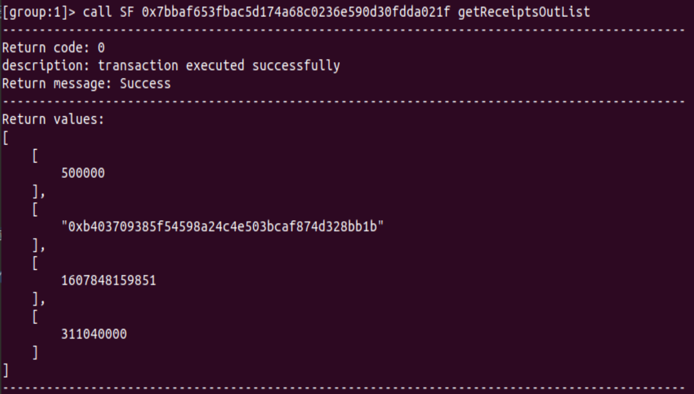

收费方的待收费列表

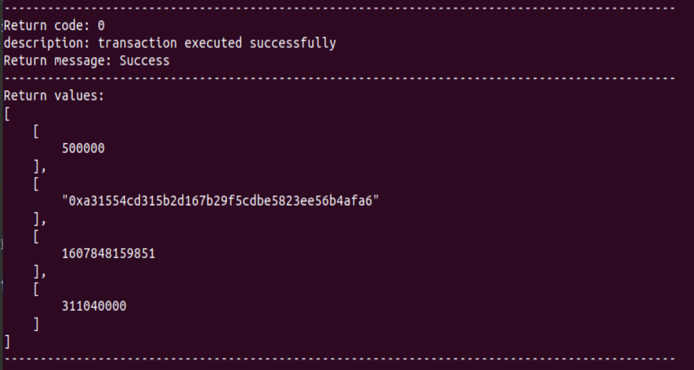

#### 异常测试

若采购商品方的信用值少于账款数值，则报错：

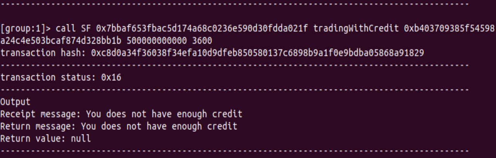

### 功能二

实现应收账款的转让上链，轮胎公司从轮毂公司购买一笔轮毂，便将于车企的应收账款单据部分转让给轮毂公司。轮毂公司可以利用这个新的单据去融资或者要求车企到期时归还钱款。

#### 正常测试

借用功能一中公司A向公司B签订的应收账款单据，公司B凭借该应收账款单据中的30万转让给C公司。调用tradingWithReceipt函数，可以根据账单时间戳转移账单。

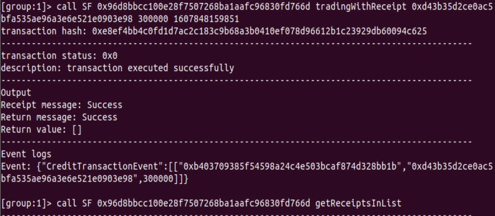

然后查看公司B的待收费账单，成功转移30万：

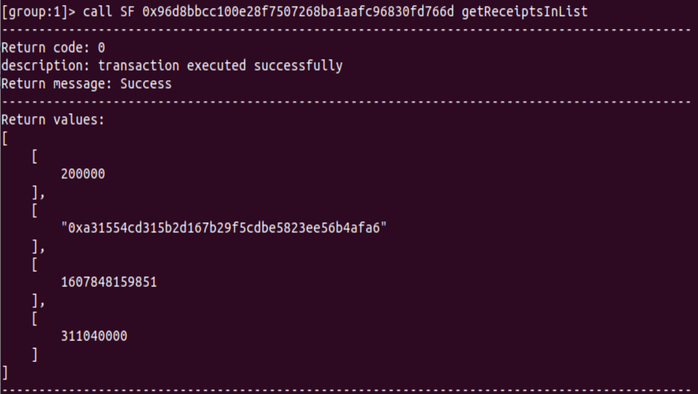

然后查看公司C的待收费账单，成功获取30万，并且支付方是A公司：

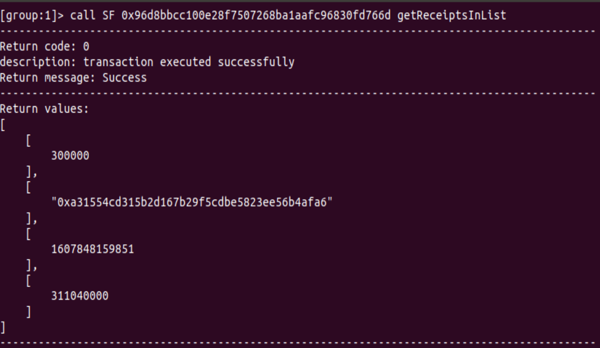

再看公司A的待支付账单，原本的账单成功分为两部分分别对应公司B和公司C:

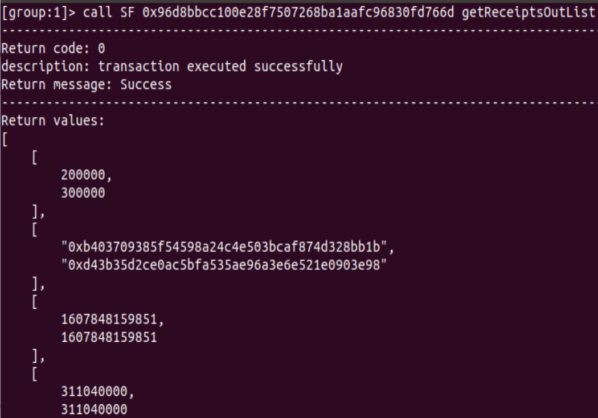

然后尝试再将B公司的该账单中的10万转移到C公司:

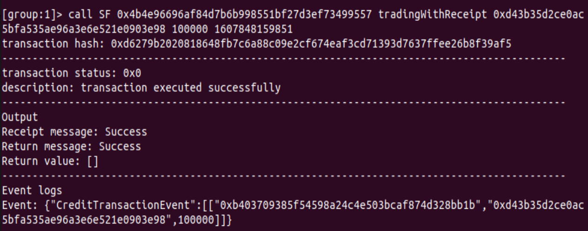

此时再查看公司B的代收款账单，原本从A获得的账单只剩10万：

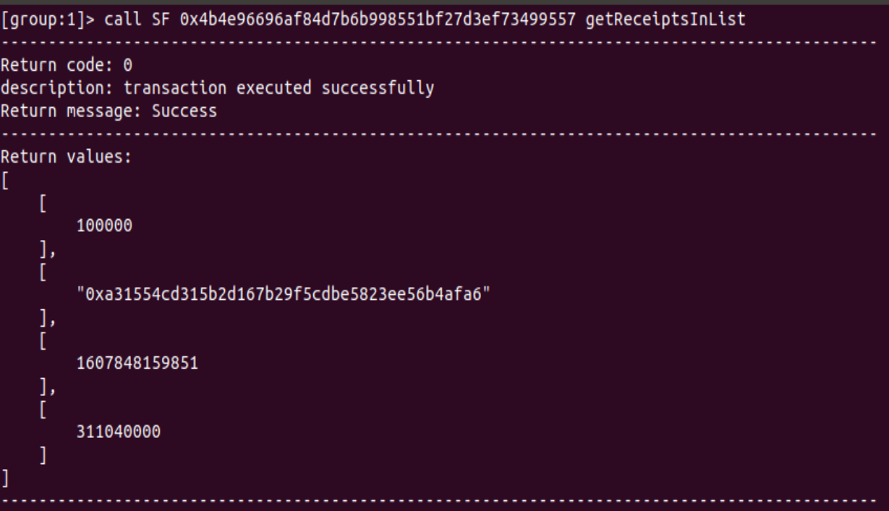

再看公司C的代收款账单，原本的账单数额上涨到40万:

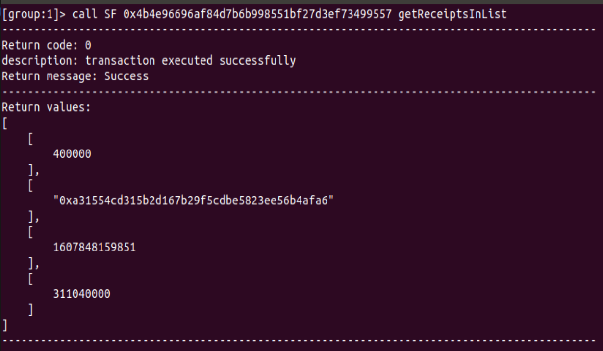

#### 异常测试

当交易数额大于账单数额时，会报错。

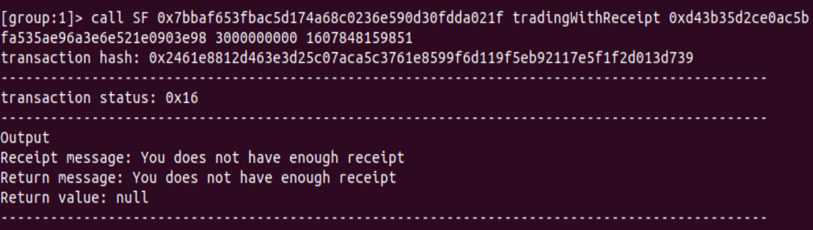

### 功能三

利用应收账款向银行融资上链，供应链上所有可以利用应收账款单据向银行申请融资。

#### 正常测试

账单的收款方可以向银行申请融资，融资数额不得大于账单。调用financing函数，根据时间戳对对应金额进行融资。

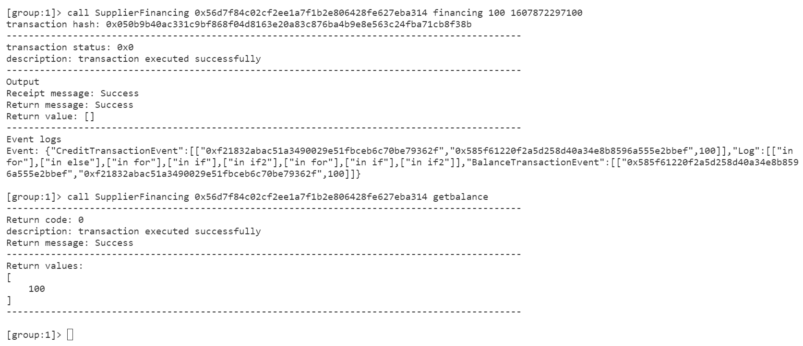

可以看到融资100元后，公司balance增加了100.

再次融资100元

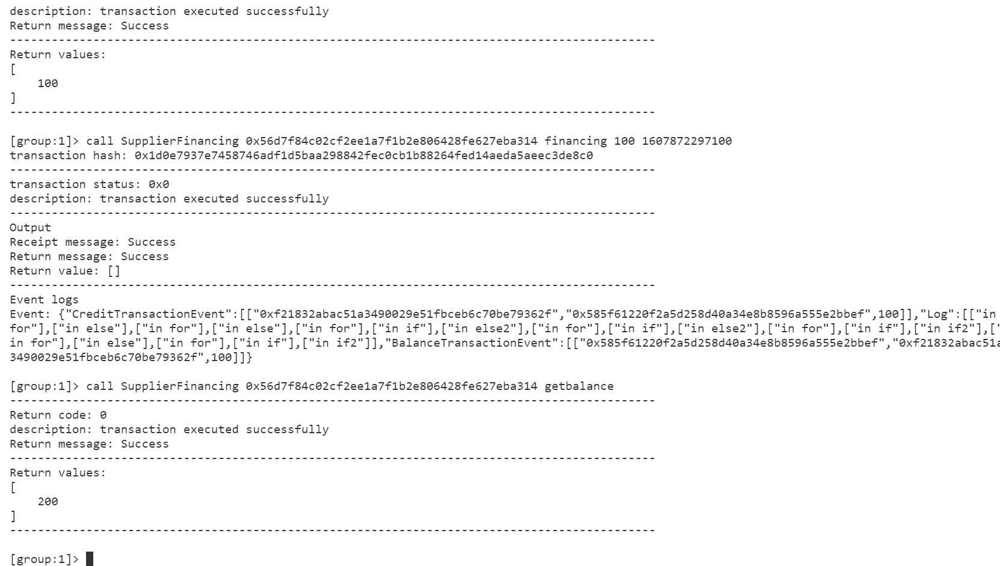

balance又增加了100。

随后账单的原支付方与银行签订一份应收账款单据。

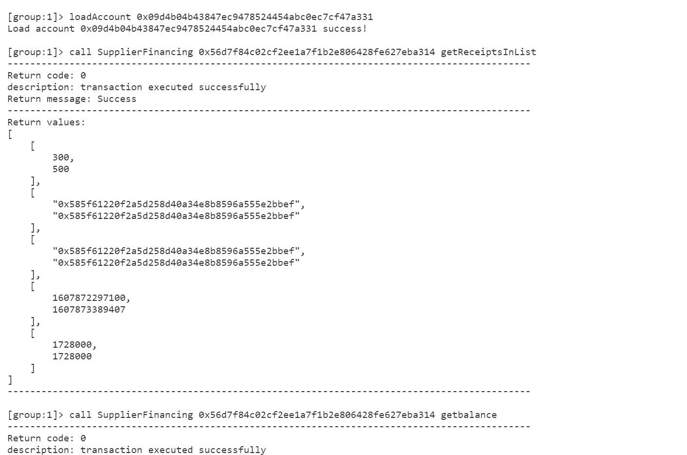


#### 异常测试

若时间戳的对应的账单的数额小于融资金额，报错。

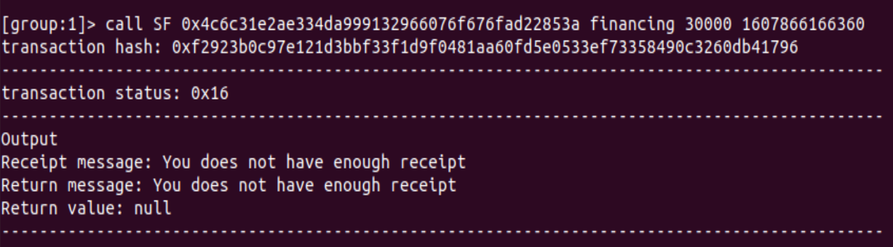

若时间戳无对应账单，报错。

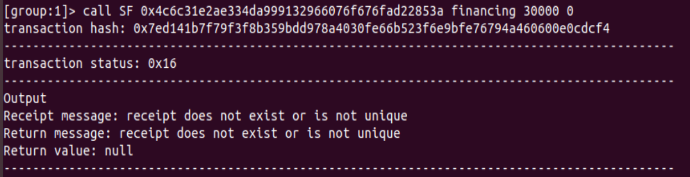

### 功能四

应收账款支付结算上链，应收账款单据到期时核心企业向下游企业支付相应的欠款。

#### 正常测试

调用arrearsPaying函数，输入单据对应时间戳还款。

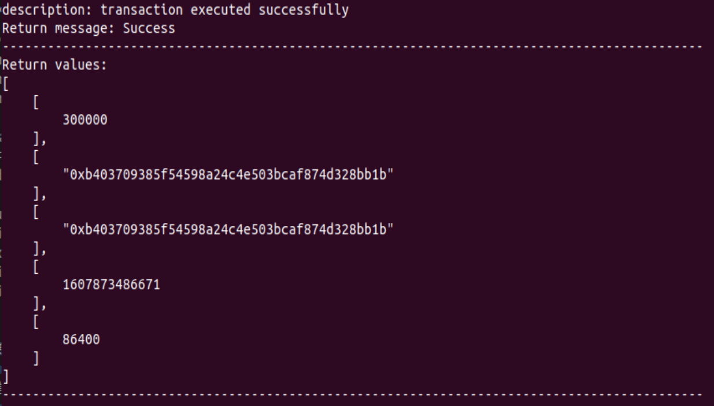

查看余额，成功扣费。

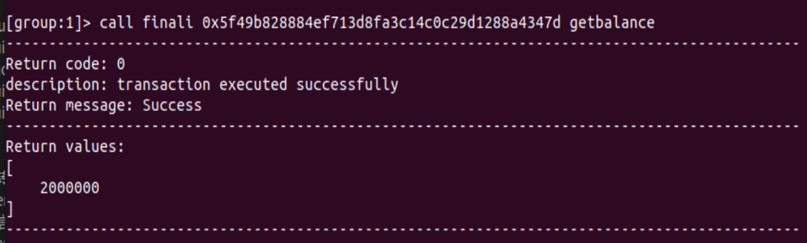


## 功能实现说明

### 功能一

​	每个公司都拥有balance和credit两个变量值，该要实现功能其实就是要实现支付方利用credit生成一个应收账款单据。我们有一个Receipts_out table保存以支付方为键值的应收账款单据情况，Receipts_in table保存以收费方为键值的应收账款单据情况，公司可以从这个表中获取自己的待收费和代付费情况，每次生成一个账单则分别插入一个表元素。若目标公司地址和金额无误，输入时间戳和有效时间，则可以生成单据。

代码如下：

```
    function tradingWithCredit(address receiver, uint amount, uint validity) public {
        uint credit = getCompanyCredit(msg.sender);
        require(amount > 0, "amount must be greater than zero");
        require(credit >= amount, "You does not have enough credit");
        updateCompanyCredit(msg.sender, credit - amount);
        uint timestamp = block.timestamp;
        validity = validity * 3600 * 24;
        insertReceipt("Receipts_out", toString(msg.sender), receiver, amount, timestamp, validity);
        insertReceipt("Receipts_in", toString(receiver), msg.sender, amount, timestamp, validity);
        emit CreditTransactionEvent(msg.sender, receiver, amount);
    }
```


### 功能二

​	实现功能二即实现应收账款单据的转移。调用函数时先判断时间戳和金额是否合法，然后要找出待转移单据的双方，减少单据的金额，然后分两种情况讨论：

1. 新的收款方与单据的付费方在该时间戳下无单据，则双方插入一个新的单据。
2. 新的收款方与单据的付费方在该时间戳下有单据，则双方在原有单据上增加数额。

代码如下：

```
    function tradingWithReceipt(address receiver, uint amount, uint timestamp) public {
        require(amount > 0, "amount must be greater than zero");
        Table receipt = openTable("Receipts_in");
        Condition condition = receipt.newCondition();
        condition.EQ("timestamp", int(timestamp));
        Entries entries = receipt.select(toString(msg.sender), condition);
        require(entries.size() == 1, "receipt does not exists or is not unique");

        uint timestampNOW = block.timestamp;
        Entry entry = entries.get(0);
        address addr = entry.getAddress("addr");
        uint receiptAmount = entry.getUInt("amount");
        uint validity = entry.getUInt("validity");
        require(receiptAmount >= amount, "You does not have enough receipt");
        require(timestamp + validity > timestampNOW, "Your receipt is out of date");
        
        entries = receipt.select(toString(receiver), condition);
        require(entries.size() <= 1, "receipt must not exists or be unique");
        
        updateReceipt("Receipts_out", toString(addr), msg.sender, timestamp, receiptAmount - amount);
        updateReceipt("Receipts_in", toString(msg.sender), addr, timestamp, receiptAmount - amount);

        if(entries.size() == 0) {
            insertReceipt("Receipts_out", toString(addr), receiver, amount, timestamp, validity);
            insertReceipt("Receipts_in", toString(receiver), addr, amount, timestamp, validity);
        }
        else {
            entry = entries.get(0);
            receiptAmount = entry.getUInt("amount");
            updateReceipt("Receipts_out", toString(addr), receiver, timestamp, receiptAmount + amount);
            updateReceipt("Receipts_in", toString(receiver), addr, timestamp, receiptAmount + amount);
        }
        emit CreditTransactionEvent(msg.sender, receiver, amount);
    }
```


### 功能三

​	融资函数在判断金额和时间戳合法性后，申请融资方可以凭借单据向银行换取balance，换取成功后，单据的金额降低，单据的支付方和银行成立一个新的单据，若双方本已有单据则在原有单据上增加金额。

代码如下：

```
    function financing(uint amount, uint timestamp) public {
        require(amount > 0, "amount must be greater than zero");
        Table receipt = openTable("Receipts_in");
        Condition condition = receipt.newCondition();
        condition.EQ("timestamp", int(timestamp));
        Entries entries = receipt.select(toString(msg.sender), condition);
        require(entries.size() == 1, "receipt does not exist or is not unique");
        Entry entry = entries.get(0);
        address addr = entry.getAddress("addr");
        uint receiptAmount = entry.getUInt("amount");
        uint validity = entry.getUInt("validity");
        require(receiptAmount >= amount, "You does not have enough receipt");

        uint balance = getCompanyBalance(adminAddr);
        require(balance >= amount, "Admin does not have enough balance");

        entries = receipt.select(toString(adminAddr), condition);
        require(entries.size() <= 1, "receipt must not exist or be unique");

        updateReceipt("Receipts_out", toString(addr), msg.sender, timestamp, receiptAmount - amount);
        updateReceipt("Receipts_in", toString(msg.sender), addr, timestamp, receiptAmount - amount);
        
        if(entries.size() == 0) {
            insertReceipt("Receipts_out", toString(addr), adminAddr, amount, timestamp, validity);
            insertReceipt("Receipts_in", toString(adminAddr), addr, amount, timestamp, validity);
        }
        else {
            entry = entries.get(0);
            receiptAmount = entry.getUInt("amount");
            updateReceipt("Receipts_out", toString(addr), adminAddr, timestamp, receiptAmount + amount);
            updateReceipt("Receipts_in", toString(adminAddr), addr, timestamp, receiptAmount + amount);
        }
        updateCompanyBalance(adminAddr, balance - amount);
        updateCompanyBalance(msg.sender, getCompanyBalance(msg.sender) + amount);

        emit CreditTransactionEvent(msg.sender, adminAddr, amount);
        emit BalanceTransactionEvent(adminAddr, msg.sender, amount);
    }
```


### 功能四

​	功能四其实就是还钱功能，单据的付费方付给收费方对应的金额，如果公司balance不足以偿还则会报错，如果足够，则偿还。但是单据上的时间戳加上有效时间如果小于偿还的时间，付费方的信誉会对应降低，迟交越久，扣得越多。

代码如下：

```
    function arrearsPaying(uint timestamp) public {
        Table receipt = openTable("Receipts_out");
        Condition condition = receipt.newCondition();
        condition.EQ("timestamp", int(timestamp));
        Entries entries = receipt.select(toString(msg.sender), condition);

        Entry entry;
        address addr;
        uint receiptAmount;
        uint validity;
        uint timestampNow = block.timestamp;
        uint balance;
        for (int i = 0; i < entries.size(); i++) {
            entry = entries.get(i);
            addr = entry.getAddress("addr");
            receiptAmount = entry.getUInt("amount");
            validity = entry.getUInt("validity");
            balance = getCompanyBalance(msg.sender);
            require(balance >= receiptAmount, "You does not have enough balance");
            updateReceipt("Receipts_out", toString(msg.sender), addr, timestamp, 0);
            updateReceipt("Receipts_in", toString(addr), msg.sender, timestamp, 0);
            updateCompanyBalance(msg.sender, balance - receiptAmount);
            updateCompanyBalance(addr, getCompanyBalance(addr) + receiptAmount);
            uint amount = 0;
            if(timestampNow > timestamp + validity) amount = (timestampNow - timestamp - validity) / 3600;
            updateCompanyCredit(msg.sender, getCompanyCredit(msg.sender) + receiptAmount - amount);
            emit CreditTransactionEvent(msg.sender, addr, receiptAmount);
            emit BalanceTransactionEvent(addr, msg.sender, receiptAmount);
        }

    }

```

